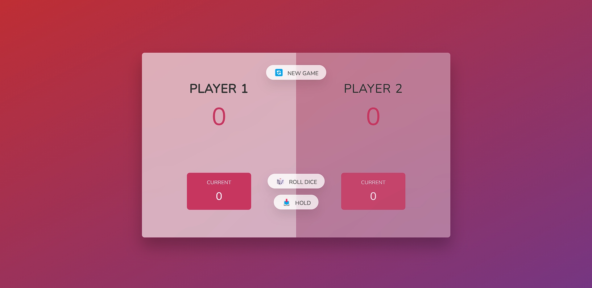

Here's an example of a **README.md** file for your **Diceomania Game** project on GitHub:

---

# 🎲 Diceomania Game 🎲

Welcome to **Diceomania**, an exciting two-player dice game where the thrill of strategy meets luck! The objective is simple: Roll the dice, accumulate points, and be the first to reach 100. But watch out! If you roll a 1, you lose your current score!

## 🖼️ Game Screenshot

## 🚀 Gameplay Features

- **2 Players**: The game is designed for two players, with the active player's section highlighted for clarity.
- **Roll the Dice**: Each player takes turns rolling the dice. If the dice shows any number between 2 and 6, it’s added to the player’s current score.
- **Hold the Score**: Players can choose to "Hold" their current score at any time, adding it to their main score. If the player rolls a 1 before holding, their current score is reset to 0.
- **Winning Criteria**: The first player to reach 100 or more points wins!
- **Dynamic Visuals**: When a player wins, the game rewards the victor with a celebration of confetti (or comfy) animations that pop up from both sides of the screen, adding a fun and visually appealing touch.

## 🎮 How to Play

1. **Roll**: Click the "Roll Dice" button to roll a dice and accumulate points in your current score.
2. **Hold**: If you're satisfied with your points and want to keep them, click the "Hold" button. Your current score will be added to your total score.
3. **Switch Turns**: If you roll a 1, your current score is lost, and it's the other player's turn.
4. **Win the Game**: The first player to reach 100 or more points wins and is greeted with a celebratory animation.

## 👨‍💻 Technologies Used

- **JavaScript**: The core logic of the game, including rolling the dice and tracking scores.
- **CSS**: For styling the game board, buttons, and animation effects.
- **HTML**: The structure of the game, defining player areas, buttons, and score displays.

## 🏆 Future Enhancements

- Adding multiplayer functionality over the web.
- Implementing sound effects for dice rolls and winning moments.
- Customizable game settings, like adjusting the winning score or adding more players.

---

Feel free to add any extra features or ideas! If you want, I can help refine this further.
